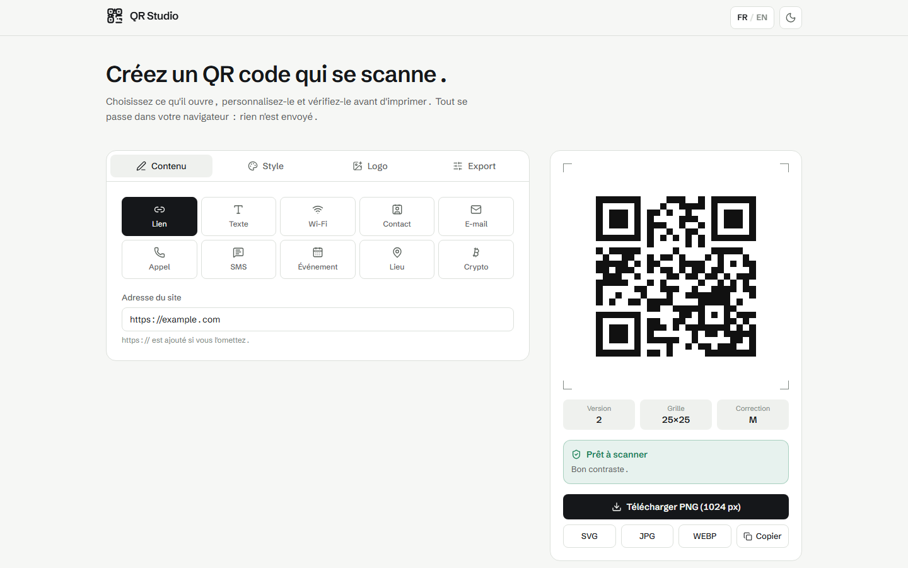

# QR Studio


Générateur de QR codes personnalisables, 100% exécuté dans le navigateur — aucune donnée n'est envoyée à un serveur.

## Description

QR Studio génère des QR codes pour dix types de contenu (URL, texte, Wi-Fi, carte de contact, e-mail, appel, SMS, événement, position GPS, adresse crypto), avec un contrôle fin du style visuel et un export prêt à l'impression ou au web. Un panneau de vérification analyse en direct le contraste, la couverture du logo et la densité de la grille pour prévenir les codes illisibles avant export. L'interface est disponible en français et en anglais, avec thème clair/sombre.

## Fonctionnalités

- **10 types de contenu** : URL, texte libre, Wi-Fi (MECARD), vCard, e-mail, téléphone, SMS, événement (iCalendar), géolocalisation, adresse crypto — chaque payload est formaté selon les conventions reconnues par les lecteurs de QR code mobiles (iOS, Google Lens, ZXing).
- **Personnalisation visuelle** : formes de module (carré, arrondi, fluide, points, feuille), styles d'yeux de repérage distincts, couleurs unies ou dégradés (linéaire/radial), rayon d'arrondi global, zone de tranquillité ajustable.
- **Logo central** avec contrôle de la taille et du rayon d'arrondi.
- **Vérification de scannabilité** : calcul de contraste (WCAG), détection d'inversion des couleurs, estimation de la couverture du logo par rapport à la capacité de correction d'erreur choisie, alerte sur marge ou densité trop élevée.
- **Export multi-format** : SVG, PNG, JPG, WebP (jusqu'à 4096 px) et copie directe de l'image dans le presse-papiers.
- **Thème clair/sombre** et **FR/EN**, préférences mémorisées localement.
- **Page 404 en 3D** : une scène Three.js chargée à la demande anime l'écran d'erreur (ce n'est pas un fond animé permanent de l'application).

## Détail technique

L'encodage QR (génération de la matrice de modules, niveaux de correction d'erreur L/M/Q/H) s'appuie sur la librairie [`qrcode`](https://www.npmjs.com/package/qrcode), conforme ISO/IEC 18004. Le travail propre à QR Studio se situe après l'encodage : calcul des positions des motifs de repérage et d'alignement, rendu SVG vectoriel personnalisé (formes de module, yeux, dégradés, logo), rasterisation canvas pour les exports PNG/JPG/WebP, et les heuristiques de vérification de scannabilité (contraste, couverture du logo vs. capacité de correction d'erreur, densité).

## Stack technique

- **React 18** + **React Router**
- **Vite 6**
- **Tailwind CSS 3**
- **qrcode** (encodage QR)
- **Three.js** (scène 3D de la page 404)
- **lucide-react** (icônes)
- Canvas API pour la rasterisation des exports

## Démo

[qrstudio-lovat.vercel.app](https://qrstudio-lovat.vercel.app)

## Capture d'écran



## Installation / lancement local

```bash
npm install
npm run dev      # http://localhost:5173
npm run build    # build de production
npm run preview  # prévisualiser le build
npm run lint
```

## Structure

```text
src/
  App.jsx                     routes (404 chargée en lazy)
  main.jsx
  styles/index.css            tokens de thème (variables CSS, clair + sombre)
  theme/ThemeProvider.jsx     état du thème, persisté en localStorage
  i18n/                       traductions FR/EN (fr.js, en.js) + hook useI18n()
  components/
    brand/Logo.jsx            logo SVG (suit le thème via currentColor)
    layout/Header.jsx         en-tête + bascule de thème
    ui/controls.jsx           champs, sliders, switches, sélecteurs de couleur
  features/qr/
    constants.js              types de contenu, formes, préréglages, valeurs par défaut
    useQrDesigner.js           état du générateur + sortie QR dérivée
    lib/payload.js            construction du texte encodé par type de contenu
    lib/matrix.js             encodage via la librairie `qrcode`
    lib/svg.js                rendu SVG (aperçu, export SVG, source du raster)
    lib/export.js             export PNG / JPG / WebP / SVG, copie presse-papiers
    lib/scanCheck.js          vérification contraste, logo, densité
    components/               panneaux (Contenu, Style, Logo, Export) + aperçu
  pages/
    GeneratorPage.jsx
    NotFoundPage.jsx          + scène 3D (three.js, 404 uniquement)
public/
  favicon.svg                 s'adapte au thème système
  brand/                      logos clair/sombre
```

---

[GitHub @nagoloumdaniel](https://github.com/nagoloumdaniel) · [Portfolio](https://nagoloum.vercel.app)
